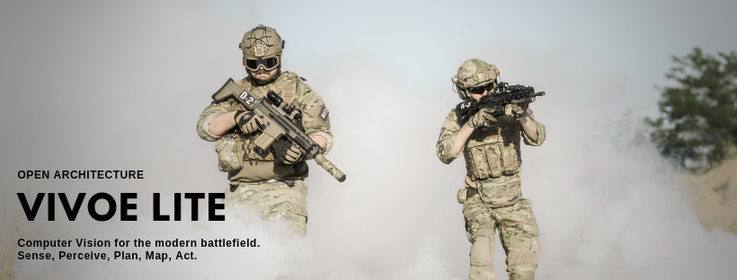
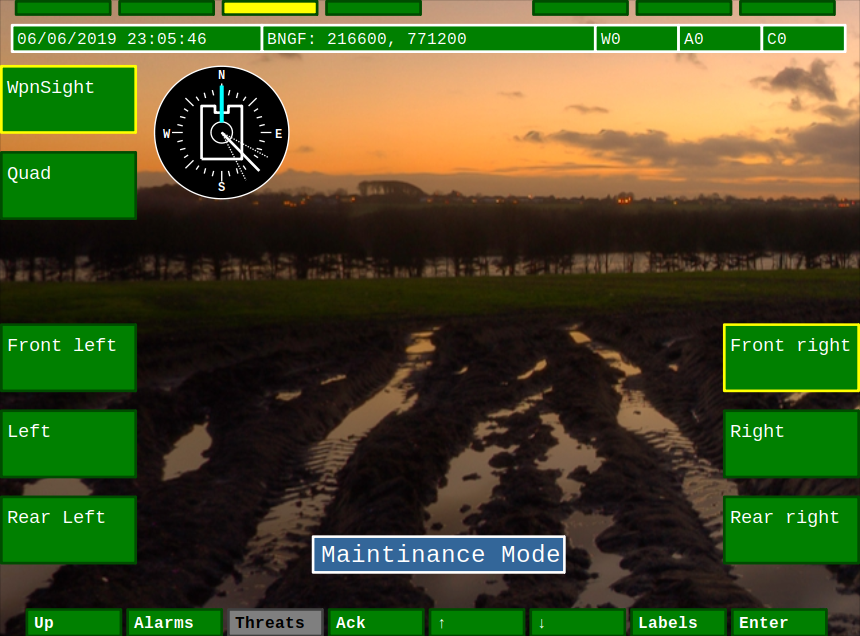
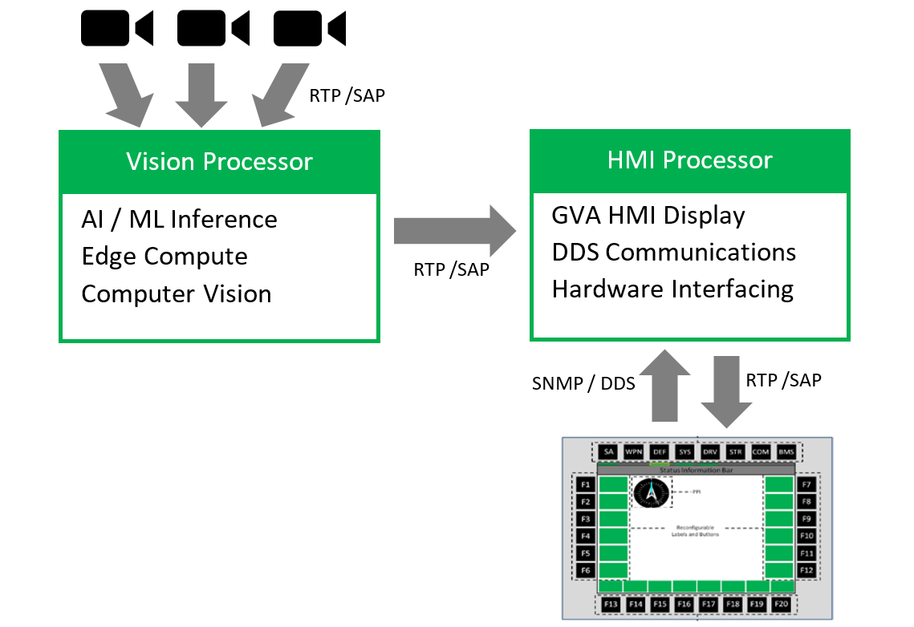
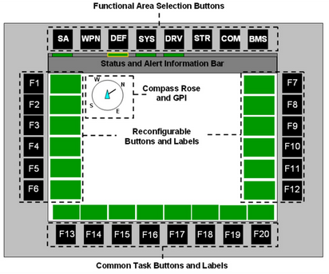

[](https://opensource.org/licenses/MIT)
# Dependancies
This VIVOE (Vetronics Infrastructure for Video Over Ethernet) environment is currently tested on Ubuntu 18.04 LTS. Please ensure you have the following packages installed prior to building the application:
```
sudo apt install libcairo2-dev libxt-dev libsdl2-dev doxygen libxml2-dev ncurses-dev libxext-dev libswscale-dev libprotobuf-
```
# HMI
The project includes an refferance implementation of the GVA Human Machin Interface (HMI). This is meant as a tool for testing different video cameras and streaming protocols and does not implement a lot of the functionality defined in the GVA Land Data Model (LDM). Its primerially used to demonstrate various video streaming pipelines and control mechanisms for real time video processing and experiment with HMI options.



Video can be streamed to an optional video processing unit (GPU/TPU for AI/ML and hemeshperical video processing) before being recieved by the HMI processor for video overlays and personalisation for gunner/commaner and driver displays. Multicast vdeo streams should be recieved by all consumers in realtime (networking not shown). There may be one or more users and displays on any given manned vehicle.



Touch screen inputs and bezel key inputs are sent back to the HMI to update the overlays in the RTP stream. The display can be 'dumb' with HMI / Video processing being done on a seperate LRU. RTP streams being recieved by the display have the overlays already rendered in the video stream.

### HMI Controls

To build the HMI clone the code and run cmake. Automated builds are handled by travis-ci.

The following keys can be used to interact with the display:
* \+ Rotate PPI clockwise
* \- Rotate PPI anti-clockwise
* \> Rotate Sight anti-clockwise
* < Rotate Sight anti-clockwise
* [1-8] Function SA,WPN...
* ESC Quit
* A Alarms
* K Keyboard
  * CAPS-LOCK toggle upper case
  * NUM-LOCK toggle special chars

## DDS
Support for FastRTPS is being tested currently and provides RTPS communication as prescribed by the GVA standards. Messages are derived from IDL that is _not_ part of the LDM. There are two DDS protocols on Github that look like good candidates for this.
* https://github.com/eProsima/Fast-RTPS
* https://github.com/ADLINK-IST/opensplice
I will be testing FastRTPS as this is the default choice for [ROS2](https://index.ros.org/doc/ros2/).

## GPS source
Application supports locally connected NMEA (USB virtual serial) GPS source. The only tested device is currently the [GlobalSat BU-353-S4 USB](https://www.amazon.co.uk/GlobalSat-BU-353-S4-Receiver-SiRF-Black/dp/B008200LHW/ref=sr_1_1?keywords=GlobalSat+BU-353-S4+USB&qid=1560375523&s=electronics&sr=1-1) available from Amazon and Robotshop. This outputs NMEA formatted strings as shown below. These are read, converted and displayed on the display in the status bar if present. This is dont by the same pthread that updated the clock. If no device is present then a dummy location is used which will place you in London at a famous landmark.
```
newmanr@dell-lnx:~/git/vivoe-lite$ cat /dev/ttyUSB0 | hexdump -C
00000000  24 47 50 47 47 41 2c 32  32 31 34 32 38 2e 30 30  |$GPGGA,221428.00|
00000010  30 2c 35 32 31 32 2e 38  35 37 36 2c 4e 2c 30 30  |0,5212.8576,N,00|
00000020  30 35 33 2e 33 39 30 37  2c 57 2c 31 2c 30 36 2c  |053.3907,W,1,06,|
00000030  31 2e 34 2c 31 31 37 2e  33 2c 4d 2c 34 37 2e 33  |1.4,117.3,M,47.3|
00000040  2c 4d 2c 2c 30 30 30 30  2a 34 35 0a 0a 24 47 50  |,M,,0000*45..$GP|
00000050  47 53 41 2c 41 2c 33 2c  30 36 2c 32 33 2c 30 32  |GSA,A,3,06,23,02|
00000060  2c 30 33 2c 31 39 2c 31  37 2c 2c 2c 2c 2c 2c 2c  |,03,19,17,,,,,,,|
00000070  32 2e 34 2c 31 2e 34 2c  32 2e 30 2a 33 42 0a 0a  |2.4,1.4,2.0*3B..|
00000080  24 47 50 52 4d 43 2c 32  32 31 34 32 38 2e 30 30  |$GPRMC,221428.00|
00000090  30 2c 41 2c 35 32 31 32  2e 38 35 37 36 2c 4e 2c  |0,A,5212.8576,N,|
000000a0  30 30 30 35 33 2e 33 39  30 37 2c 57 2c 30 2e 35  |00053.3907,W,0.5|
000000b0  31 2c 39 34 2e 33 36 2c  31 32 30 36 31 39 2c 2c  |1,94.36,120619,,|
000000c0  2c 41 2a 34 31 0a 0a 24  47 50 47 47 41 2c 32 32  |,A*41..$GPGGA,22|
000000d0  31 34 32 39 2e 30 30 30  2c 35 32 31 32 2e 38 35  |1429.000,5212.85|
000000e0  37 37 2c 4e 2c 30 30 30  35 33 2e 33 39 31 35 2c  |77,N,00053.3915,|
000000f0  57 2c 31 2c 30 36 2c 31  2e 34 2c 31 31 37 2e 35  |W,1,06,1.4,117.5|
00000100  2c 4d 2c 34 37 2e 33 2c  4d 2c 2c 30 30 30 30 2a  |,M,47.3,M,,0000*|
00000110  34 30 0a 0a 24 47 50 47  53 41 2c 41 2c 33 2c 30  |40..$GPGSA,A,3,0|
00000120  36 2c 32 33 2c 30 32 2c  30 33 2c 31 39 2c 31 37  |6,23,02,03,19,17|
00000130  2c 2c 2c 2c 2c 2c 2c 32  2e 34 2c 31 2e 34 2c 32  |,,,,,,,2.4,1.4,2|
00000140  2e 30 2a 33 42 0a 0a 24  47 50 52 4d 43 2c 32 32  |.0*3B..$GPRMC,22|
```
# Configuration
GVA parameters and system wide setting are read in from the .xml configuration files. These are listed below:
## config.xml
This is a list of the config filenames. This is the only file that needs to be read into the HMI application to be able to read all the settings.
```
<?xml version="1.0"?>
<Config>
  <XmlFiles>
     <GvaConfig>gva-config.xml</GvaConfig>
     <VideoSourcesConfig>video-sources-config.xml</VideoSourcesConfig>
     <DisplaysConfig>displays-config.xml</DisplaysConfig>
     <HmiCommanderConfig>hmi-commander-config.xml</HmiCommanderConfig>
     <DdsConfig>dds-config.xml</DdsConfig>
  </XmlFiles>
</Config>
```
## gva-config.xml
Nearly all the input sources are 4:3 input ratio with the exception of SXVGA which is 5:4. 16:9 may be added later when the HMI spec allows. Colours are taken from the HMI spec.
```
<?xml version="1.0"?>
<Gva>
  <Resolutions>
    <Mode>
      <Name>QVGA</Name>
      <Dimension>320x240</Dimension>
    </Mode>
    <Mode>
      <Name>VGA</Name>
      <Dimension>640x480</Dimension>
    </Mode>
    <Mode>
      <Name>PAL</Name>
      <Dimension>768x5760</Dimension>
    </Mode>
    <Mode>
      <Name>SVGA</Name>
      <Dimension>800x600</Dimension>
    </Mode>
    <Mode>
      <Name>XVGA</Name>
      <Dimension>1024x768</Dimension>
    </Mode>
    <Mode>
      <Name>HIRES</Name>
      <Dimension>1280x960</Dimension>
    </Mode>
    <Mode>
      <Name>SXVGA</Name>
      <Dimension>1280x1024</Dimension>
    </Mode>
    <Mode>
      <Name>SXVGA+</Name>
      <Dimension>1400x1050</Dimension>
    </Mode>
    <Mode>
      <Name>UXVGA</Name>
      <Dimension>1600x1200</Dimension>
    </Mode>
    <Mode>
      <Name>QXVGA</Name>
      <Dimension>2048x1200</Dimension>
    </Mode>
  </Resolutions>
  <Presentation>
    <ColourOnGoodOkSafe>#00FF00</ColourOnGoodOkSafe>
    <ColourAdvisoryWarning>#FFFF00</ColourAdvisoryWarning>
    <ColourCaution>#FF9900</ColourCaution>
    <ColourArmedDangerCriticalWarningFailureStop>#FF0000</ColourArmedDangerCriticalWarningFailureStop>
    <ColourNotAvailableOff>#7F7F7F</ColourNotAvailableOff>
    <ColourBackgroundSoftKeySoftLabel>#004B00</ColourBackgroundSoftKeySoftLabel>
  </Presentation>
</Gva>
```
## video-sources-config.xml
Valid inputs will use the allowed resolutions from **gva-config.xml**
```
<?xml version="1.0"?>
<Inputs>
</Inputs>
```
## displays-config.xml
This file describes the screen types available on the platform
```
<?xml version="1.0"?>
<Displays>
  <Screen>
    <Name>Commander_1<Name>
    <Resolution>VGA<Resolution>
  </Screen>
  <Screen>
    <Name>Driver_1<Name>
    <Resolution>VGA<Resolution>
  </Screen>
  <Screen>
    <Name>Driver_2<Name>
    <Resolution>VGA<Resolution>
  </Screen>
  <Screen>
    <Name>Gunner_1<Name>
    <Resolution>VGA<Resolution>
  </Screen>
</Displays>
```
## hmi-commander-config.xml
This describes the HMI screens and funstions available to the Commander.
```
<?xml version="1.0"?>
<Commander>
  <Screen>
    <Name>Commander_1<\Name>
    <SYS>...<\SYS>
    <BMS>...<\BMS>
  </Screen>
</Commander>
```
# Conformance to UK MoD / NATO Defence Standards
The sample HMI provided was created to comply with the design guidline layed out in Defence Standard 23-09 Part 2 Generic Vehicle Architecture (GVA) Human Machine Interface, Issue 3 as shown below.
## DEF STAN 23-09 - Generic Vehicle Architecture (GVA)
Defence Standard 23-09 is currently split into the parts below:

*  Part 0 - The GVA Approach
*  Part 1 - Infrastructure (Data and Power)
*  **Part 2 - Human Machine Interface**
*  Part 3 - Health and Usage Monitoring (issued Dec 2015)
*  Part 4 - Physical Interfaces (withdrawn)
*  Part 5 - GVA Data Model and Model Driven Architecture[6]
*  Part 6 - Security (TBD)
*  Part 7 - Common Services (TBD)
*  Part 8 - Safety (TBD)

## DEF STAN 00-83 - Vetronics Infrastructure for Video Over Ethernet (VIVOE)
For the video streaming element of the sample HMI the RTP raw video streams conform to Defence Standard 00-83 Vetronics Infrastructure
for Video Over Ethernet Part 1: Standards and Protocols, Issue 2. Specifically Appendix B2 YCbCr 4:2:2 Encoded Uncompressed Video.

Defence Standard 00-083 is currently split into the parts below.

*  Vetronics Infrastructure for Video Over Ethernet Part: 0 : Guidance 
*  **Vetronics Infrastructure for Video Over Ethernet Part: 1 : Standards and Protocols**
*  Vetronics Infrastructure for Video Over Ethernet Part: 2 : Extensions for Audio and Acoustic Data 

This standard is also mandated in the NATO version of GVA (NGVA). 

## STANAG 4754 - NATO Generic Vehicle Architecture (NGVA)
NGVA is a NATO Standardisation Agreement (STANAG 4754) based on open standards to design and integrate multiple electronic sub-systems onto military vehicles which are controllable from a multifunction crew display and control unit. 

## STANAG 4697 - Platform Extended VIdeo StandarD (PLEVID)
AIM The aim of this NATO standardization agreement (STANAG) is to respond to the following interoperability requirements. Adopts DEF STAN 00-083 and allows for GigE.

# Rendering
The HMI uses Cairo for rendering the GUI components.



**GVA HMI Example layout**

# Links
* https://www.cairographics.org/
* https://www.vetronics.org/
* https://en.wikipedia.org/wiki/Generic_Vehicle_Architecture
* https://index.ros.org/doc/ros2/
