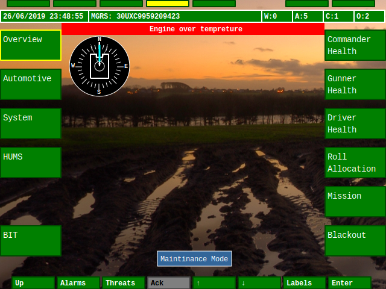
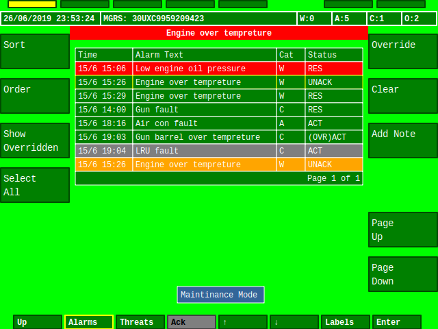
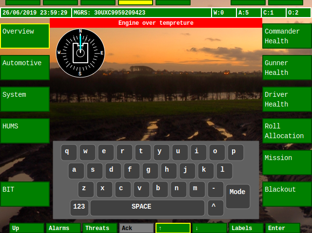
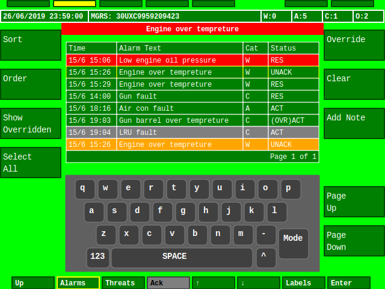
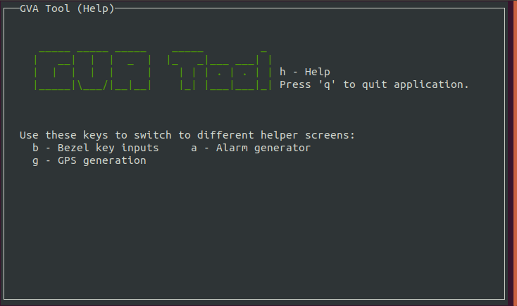

# Screenshots
## hmi-display

 
**SYS Screen**

 
**BMS Screen (offline maps © OpenStreetMap contributor rendered with OSMScout)**

 
**Alarms Screen**

 
**Keyboard example**

 
**Keyboard / Alarms example**

## gva-tool
 
**GVA test tool**
